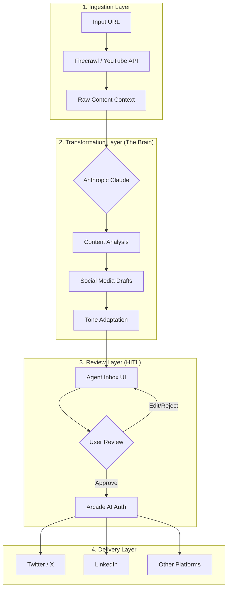
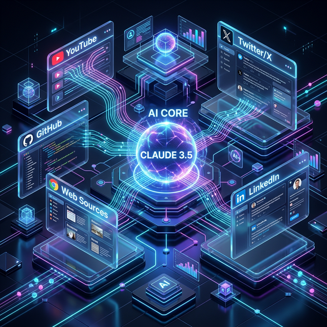

# 🤖 Omni-Channel Social Media Agent

> **One URL. Any Content. Every Platform.**

The **Omni-Channel Social Media Agent** is a high-performance, autonomous system designed to transform diverse content sources into viral social media posts. Whether it's a technical GitHub repo, a deep-dive YouTube video, or a trending news article, this agent digests the context and adapts its tone to match your unique brand voice.

---

## 🏗️ System Architecture

The project follows a **Human-in-the-Loop (HITL)** orchestration pattern using LangGraph. Below is the high-level workflow:



### High-Level Visual


---

## 📁 Project Structure

This repository contains both the AI Backend and the Frontend UI for a seamless experience:

-   **/ (Root)**: The LangGraph backend (The Brain).
-   **/agent-inbox**: The Next.js frontend (The UI).

---

## ✨ Key Features

-   **🌐 Omni-Channel Ingestion**: Automatically handles GitHub Repos, Twitter Threads, YouTube Videos, and standard web pages.
-   **🎭 Adaptive Persona**: Swap between a "Professional Executive", "Solo-Dev Tinkerer", or "Energetic Vlogger" tone with simple prompt configuration.
-   **📥 Human-in-the-Loop**: Never post a hallucination! All drafts are sent to a private Inbox UI for your final seal of approval.
-   **🔐 Secure Posting**: Integrated with **Arcade AI** for secure, programmatic access to your social accounts without managing complex OAuth flows.

---

## 🚀 Getting Started

### 1. Prerequisites
You will need API keys for:
- [Anthropic](https://console.anthropic.com/) (Brain)
- [Firecrawl](https://www.firecrawl.dev/) (Web Scraping)
- [Arcade](https://www.arcade.dev/) (Social Posting)
- [LangSmith](https://smith.langchain.com/) (Orchestration & UI)

### 2. Quick Setup
```bash
# Clone and install
yarn install

# Configure environment
cp .env.quickstart.example .env

# Start the LangGraph server
yarn langgraph:in_mem:up
```

### 3. Usage
Run the generation script with any URL:
```bash
yarn generate_post --url https://github.com/langchain-ai/langgraph
```

---

## 🎨 Customization

To make the agent yours, modify the files in `src/agents/generate-post/prompts/`:
- **`index.ts`**: Update the `BUSINESS_CONTEXT` to describe your brand.
- **`examples.ts`**: Add 3-5 of your own successful posts to teach the agent your style.

---

## 📜 License

MIT License - Built with ❤️ by Siddiq Ahmed.
